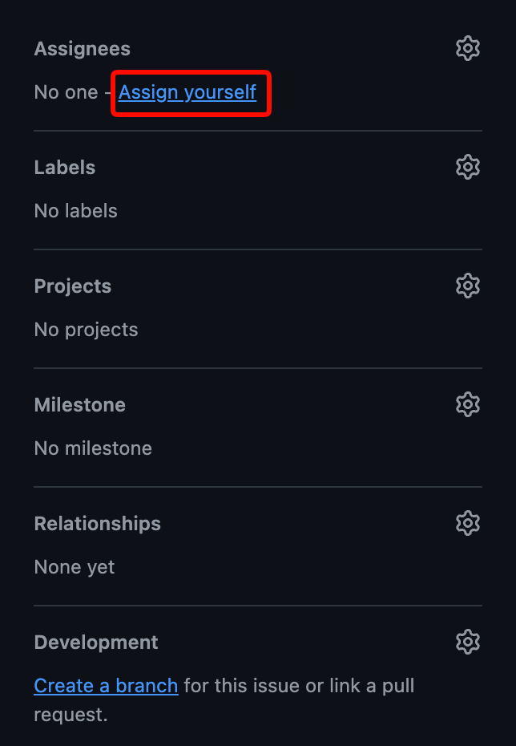

# Contributing To Opensource-Practice

## 빈 화면 채우기 (issues 답변)

현재 [사이트](https://osm-dev-io.github.io/opensource-practice/)의 여러 페이지가 비어 있습니다. 각 페이지에 들어갈 내용을 함께 채워 주세요. [이슈 탭](https://github.com/osm-dev-io/opensource-practice/issues)에 페이지별 이슈를 만들어 두었으니 다음 순서로 참여해 주세요.

1. 자신에게 해당하는 이슈를 찾아 들어갑니다.
2. 이슈의 assignee를 본인으로 설정합니다.

   

3. 이슈에 어떤 내용으로 채울지 답변으로 적습니다.

   예시: “제가 해볼게요. 관심 분야랑 프로필 사진을 넣어서 꾸며보겠습니다.”

## 버그 제보하기

[수강생들께 드리는 말씀](https://osm-dev-io.github.io/opensource-practice/notice/index.html) 페이지에 현재 버그와 오타가 많습니다. 발견한 문제를 [이슈 탭](https://github.com/osm-dev-io/opensource-practice/issues)을 통해 제보해 주세요.

버그 제보 이슈는 아래와 같이 적어 주세요.

- 최대한 구체적으로 증상을 설명합니다.
- 가능하다면 스크린샷을 첨부합니다.
