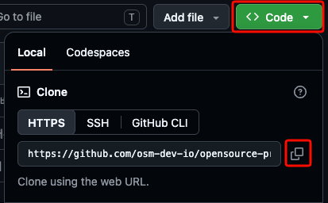
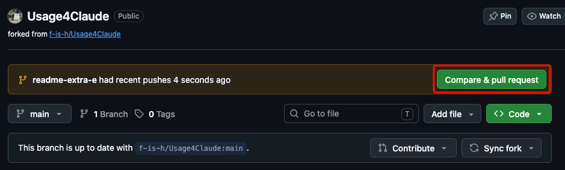
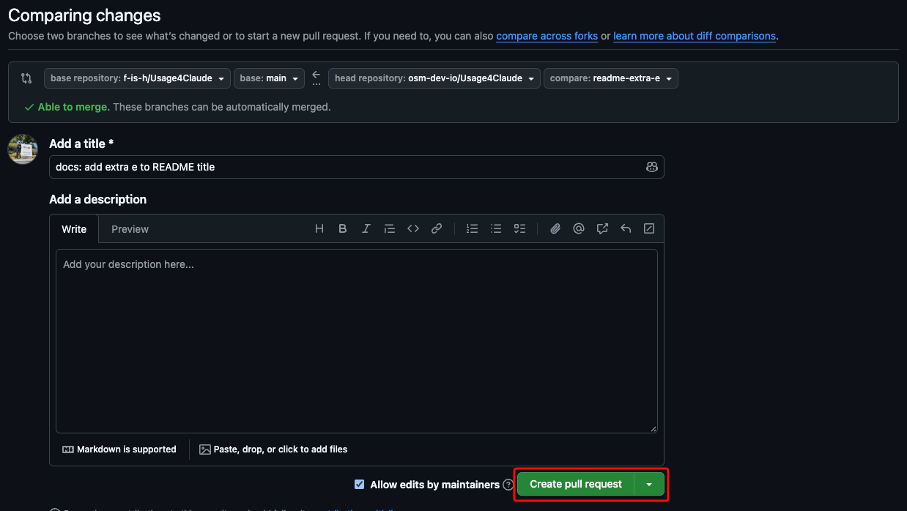

# Contributing To Opensource-Practice

## 빈 화면 채우기 (issues 답변)

현재 [사이트](https://osm-dev-io.github.io/opensource-practice/)의 여러 페이지가 비어 있습니다. 각 페이지에 들어갈 내용을 함께 채워 주세요. [이슈 탭](https://github.com/osm-dev-io/opensource-practice/issues)에 페이지별 이슈를 만들어 두었으니 다음 순서로 참여해 주세요.

1. 자신에게 해당하는 이슈를 찾아 들어갑니다.
2. 이슈의 assignee를 본인으로 설정합니다.

   

3. 이슈에 어떤 내용으로 채울지 답변으로 적습니다.

   예시: “제가 해볼게요. 관심 분야랑 프로필 사진을 넣어서 꾸며보겠습니다.”

## 버그 제보하기 (issues 생성)

[수강생들께 드리는 말씀](https://osm-dev-io.github.io/opensource-practice/notice/index.html) 페이지에 현재 버그와 오타가 많습니다. 발견한 문제를 [이슈 탭](https://github.com/osm-dev-io/opensource-practice/issues)을 통해 제보해 주세요.

버그 제보 이슈는 아래와 같이 적어 주세요.

- 최대한 구체적으로 증상을 설명합니다.
- 가능하다면 스크린샷을 첨부합니다.

모범 사례는 [이슈 #16](https://github.com/osm-dev-io/opensource-practice/issues/16)을 참고해 주세요.

## 빈 화면 채우기 (PR 제출)

1. **저장소를 fork합니다.**

   GitHub에서 이 저장소를 본인 계정으로 fork합니다.

   

2. **저장소를 Clone합니다.**

   fork한 본인 저장소 페이지에서 **Code**를 누르고 HTTPS URL을 복사합니다.

   

   터미널에서 복사한 URL을 사용해 저장소를 clone합니다.

   ```bash
   git clone <복사한 url>
   ```

3. **새 브랜치를 생성합니다.**

   clone한 저장소 폴더로 이동합니다.

   ```bash
   cd opensource-practice
   ```

   `git switch -c` 명령으로 브랜치를 만들고 바로 해당 브랜치로 이동합니다. 브랜치 이름은 작업 내용을 알기 쉽게 정하고, 단어 사이는 하이픈(`-`)으로 연결합니다.

   ```bash
   git switch -c add-profile-page
   ```

   Git 버전이 낮아 `git switch`를 사용할 수 없다면 아래 명령으로 같은 작업을 할 수 있습니다.

   ```bash
   git checkout -b add-profile-page
   ```

4. **변경 사항을 만듭니다.**

   본인 페이지의 파일을 수정해 소개, 관심 분야, 프로필 사진 등 원하는 내용을 추가합니다. 본인 페이지는 어떤 내용이나 방식으로든 자유롭게 변경할 수 있으며, 변경에 제한은 없습니다. **본인 페이지 외 다른 수강생의 페이지는 수정하지 마세요.**

5. **커밋합니다.**

   변경 내용을 스테이징한 뒤, 무엇을 수정했는지 알 수 있는 메시지와 함께 커밋합니다.

   ```bash
   git add .
   git commit -m "프로필 페이지 내용 추가"
   ```

6. **작업 브랜치를 Push합니다.**

   작업 브랜치를 본인 fork에 처음 push할 때는 아래 명령을 사용합니다. `-u` 옵션은 로컬 브랜치와 원격 브랜치를 연결해 이후 `git push`만으로 올릴 수 있게 합니다.

   ```bash
   git push -u origin add-profile-page
   ```

7. **PR을 생성합니다.**

   GitHub에서 본인 fork의 작업 브랜치와 원본 저장소의 `main` 브랜치를 비교해 Pull Request를 엽니다. 변경한 내용과 목적을 설명에 적어 주세요.

   본인 fork 저장소에서 **Compare & pull request**를 누르거나, 비교 화면에서 원본 저장소와 `main` 브랜치가 base로 선택되어 있는지 확인한 뒤 제목과 설명을 작성하고 **Create pull request**를 누릅니다.

   

   
